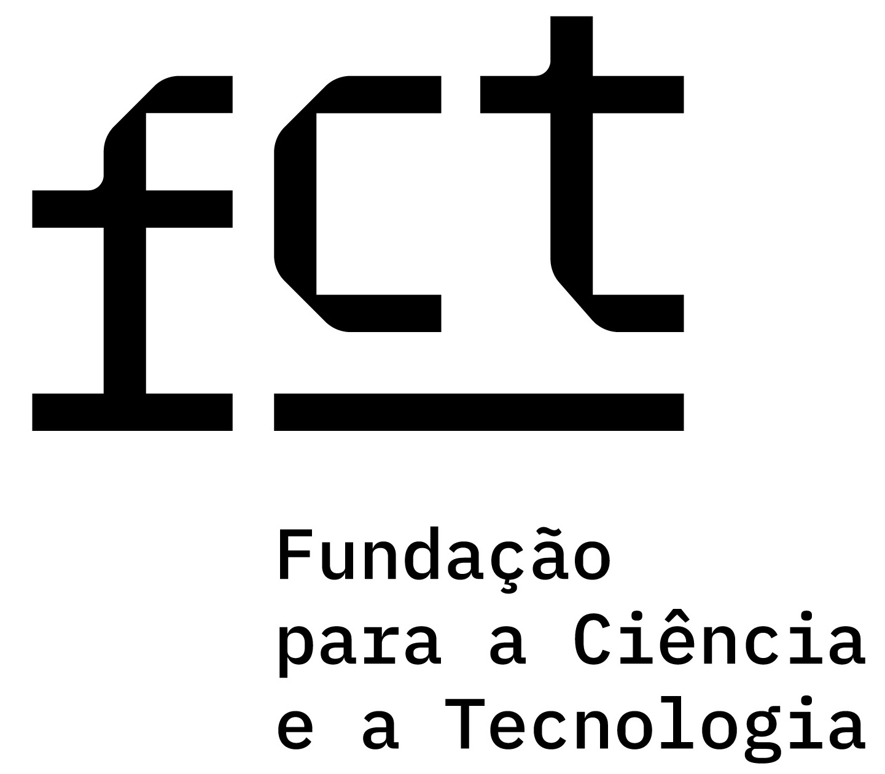

# MorFacing: Face Morphing Robustness benchmarking

This repo includes functionality for robustness of face recognition methods to face morphing attacks from the paper: "MorFacing: A Benchmark for Estimation Face Recognition Robustness to Face Morphing Attacks".
The project may be used for performing benchmarks on developer side and further submitting results for comparison between different developers.
The project only unifies the data, protocols, performance estimation, results comparison. 
**The extracting of the predictions data is up to the developer.**
We only propose an example for generating random predictions [generate predictions of test_model](./mf_utils/generate_predictions_test_model.py).

## Executing Benchmark

1. [Get](#Data) and align them to match your model.
(Or if suitable for your model use [aligned data](#Data)).  
To align the data we use [MTCNN](https://github.com/ipazc/mtcnn).
We propose to have separate directories for different types of alignment.

2. Implement the function for extracting model prediction from image path in extract_prediction.py. 
The name of the function must match the name of the model.

3. Execute the benchmark for your model.
```
python run_benchmark.py --models_path "./models/" --model_name "name_of_your_model" 

```

## Results comparison

To compare several results and plot together curves for defined protocols, run 
the script specifying protocol label and models for comparison:
```
python compare_models_mmpmr.py  
python compare_models_mmpmr.py -m ArcFace_R50_ms1mv2 MagFace_R50_ms1mv2 -d "ArcFace" "MagFace" -l stylegan -r MMPMR -f FMR

python compare_models_rmmr.py  
python compare_models_rmmr.py -m ArcFace_R50_ms1mv2 MagFace_R50_ms1mv2 -d "ArcFace" "MagFace" -l stylegan -r MMPMR

```

Result curves will appear in the ```/combined_results```.


## Submitting
### How to submit your results

Make a pull request with your model folder (only with the results) to this repo
  
 ```
 Detailed manual Soon
 ```

## Generaing new morphs

To extend this toolset with you morphs(generated with your method):

1. [Get data](#Data).

2. Generate morphs according to the [protocol](./morphing_pairing_protocols/morphing_protocol_N5.txt)

### Sharing new morphs
If you want to contribute and extend this repo with your morphs (generated with your method):

Send them together with the method description (preferably the reference to the publication) to [Contact](#Contacts) with the shared link from the same email domain that was used for the data request.


## Data

To get the actual version of the data please complete a licence agreement and send it to the [Contact](#Contacts)
In the responce email you will receive a temporary link to the data. 

## Licence agreement
Licensing of the data is covered by two documents:

1. [Licence Agreement cover page for MorFacing Dataset](./licence_agreements/agreement_MorFacing.pdf)

2. [Licence Agreement fo BDFC Dataset](./licence_agreements/LA_BDFC_v1.0.pdf)

Read those documents and sign the Licence Agreement cover page for MorFacing Dataset. By signing it you also accept the terms and conditions covered by the Licence Agreement fo BDFC Dataset.
Send two documents (the [signed Cover page](./licence_agreements/agreement_MorFacing.pdf) and a copy of [Licence Agreement fo BDFC Dataset](./licence_agreements/LA_BDFC_v1.0.pdf)) to the primary and secondary contacts indicated in this repo ([Contact](#Contacts)).


If you use results of our work in your research, please cite these works in your publications:
```
@INPROCEEDINGS{10744449,
author={Medvedev, Iurii and Gonçalves, Nuno},
booktitle={2024 IEEE International Joint Conference on Biometrics (IJCB)}, 
title={MorFacing: A Benchmark for Estimation Face Recognition Robustness to Face Morphing Attacks}, 
year={2024},
volume={},
number={},
pages={1-10},
keywords={Measurement;Printing;Deep learning;Protocols;Face recognition;Estimation;Authentication;Benchmark testing;Robustness;Security;face morphing (FM);face recognition (FR);face recognition system(FRS) computer vision;deep learning},
doi={10.1109/IJCB62174.2024.10744449}}

```

```
@INPROCEEDINGS{10345995,
author={Guerra, Carla and Marcos, João and Gonçalves, Nuno},
booktitle={2023 International Conference of the Biometrics Special Interest Group (BIOSIG)}, 
title={Automatic Validation of ICAO Compliance Regarding Head Coverings: An Inclusive Approach Concerning Religious Circumstances}, 
year={2023},
volume={},
number={},
pages={1-4},
keywords={Head;Biometrics (access control);Biological system modeling;Magnetic heads;Data models;Cultural differences;Biomedical imaging;Facial Images;ICAO;ISO/IEC 19794–5;Head Covering Detection;Deep Learning},
doi={10.1109/BIOSIG58226.2023.10345995}}
```

## Contacts

| Contact    | email |
| -------- | ------- |
| Primary Contact  | visteam@isr.uc.pt   |
| Secondary Contact  | iurii.medvedev@isr.uc.pt   |


## Versioning
Version 1.0

## Acknowledgements
The authors would like to thank the Portuguese Mint and Official Printing Office (INCM) and the 
[Institute of Systems and Robotics - University of Coimbra](https://www.isr.uc.pt) for the support of the project Facing. 
[This work has been supported by Fundação para a Ciência e a Tecnologia (FCT)](https://www.fct.pt/) under the 
project UIDB/00048/2020 and 2022.11941.BD.  The computational part of this work was performed with the support of 
NVIDIA Applied Research Accelerator Program with hardware and software provided by [NVIDIA](https://developer.nvidia.com/higher-education-and-research).


<p float="left">
  
  
  
  
</p>

